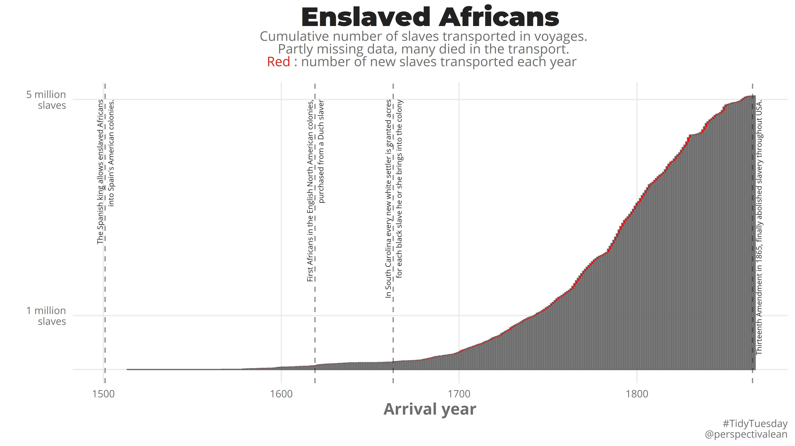
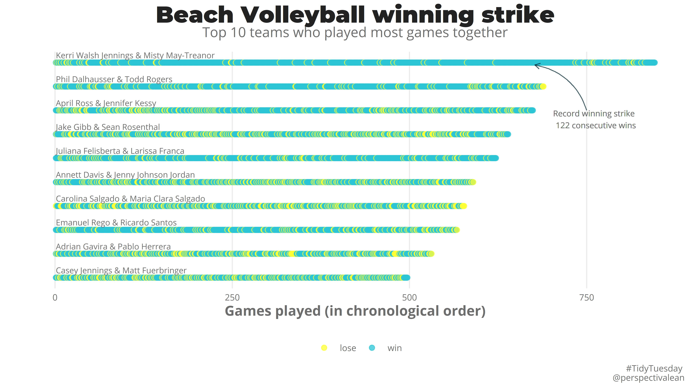
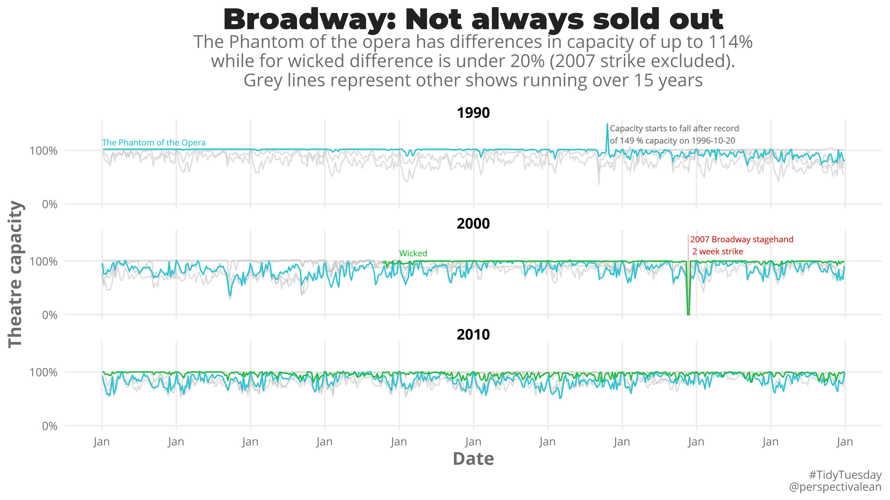
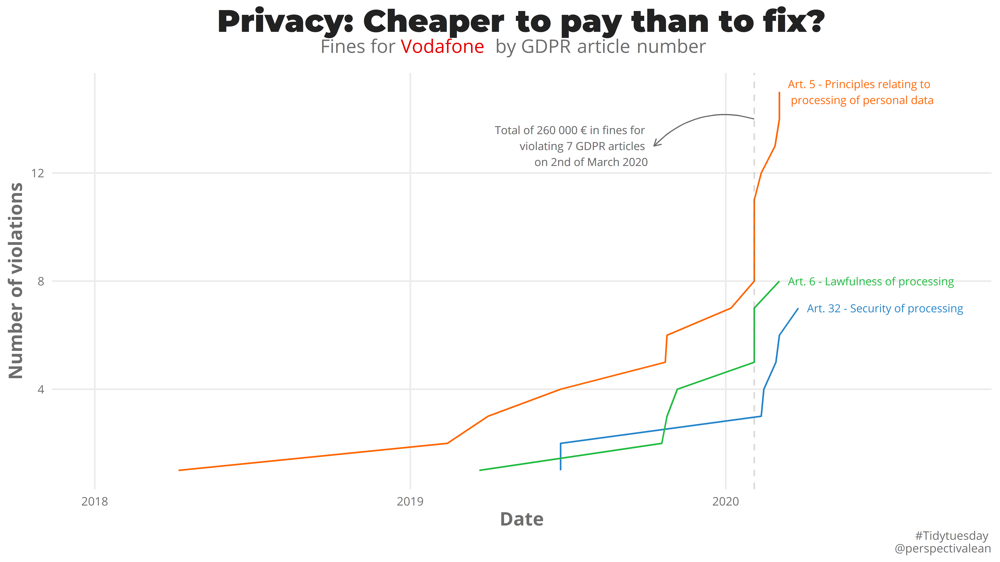
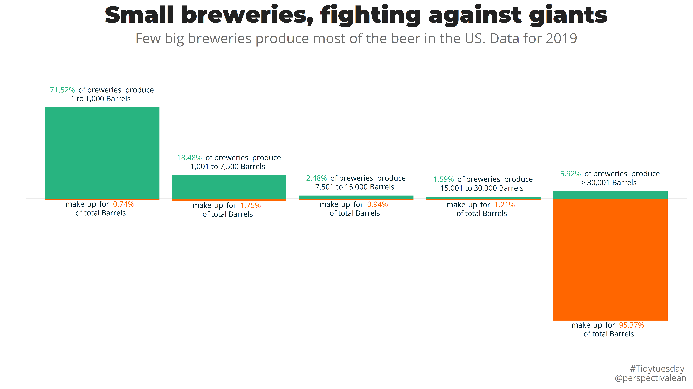
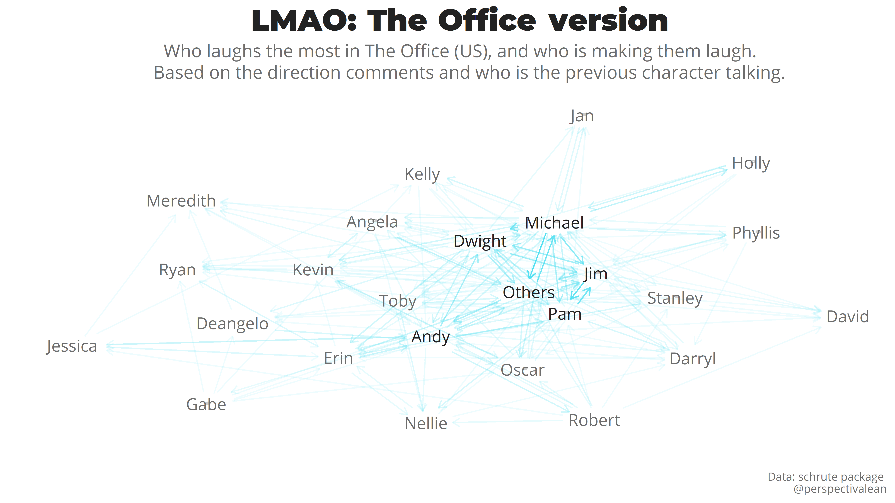
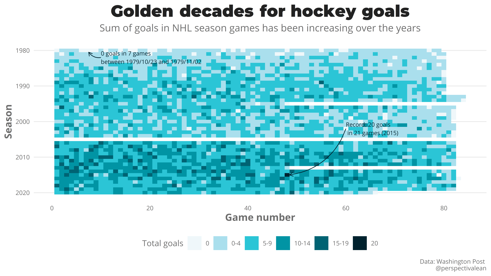
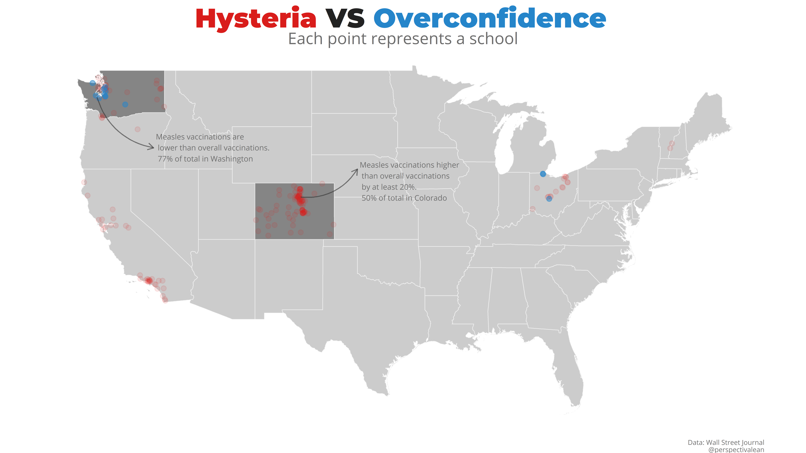
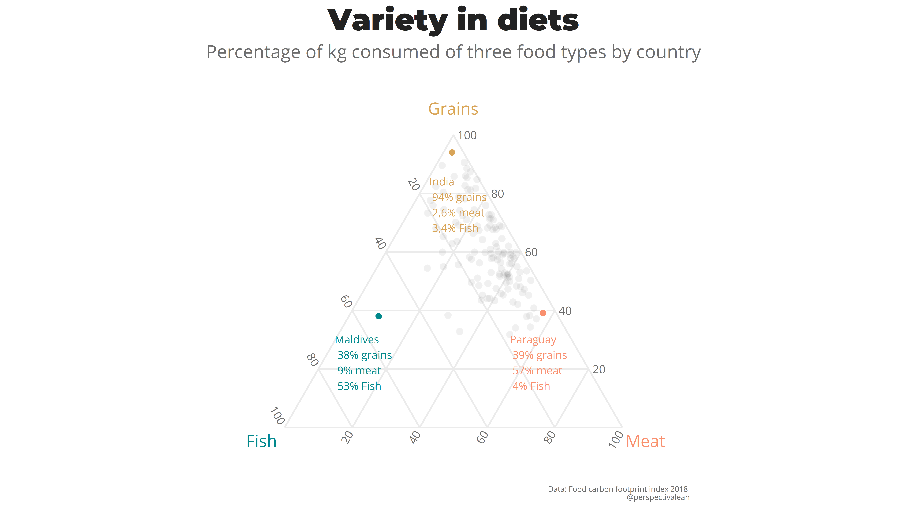

Submissions of tidy tuesdays
# 2020
## Week 29 - Astronauts

## Week 26 - Caribou movements

## Week 25 - Slave voyages

## Week 21 - Beach Voleyball

## Week 18 - Broadway

## Week 17 - GDPR fines in Europe

## Week 14 - Breweries in USA

## Week 12 - The Office

## Week 10 - NHL goals

## Week 9 - Measles and vaccinations in USA

## Week 8 - Food consumption and CO2

## Week 7 - Hotel bookings

## Week 6 - Superbowl

## Week 4 - Spotify songs

# 2019
## Week 47 - New Zealand bird competition

## Week 46 - CRAN packages languages

## Week 42 - Car emissions

## Week 41 - Women powerlifting

