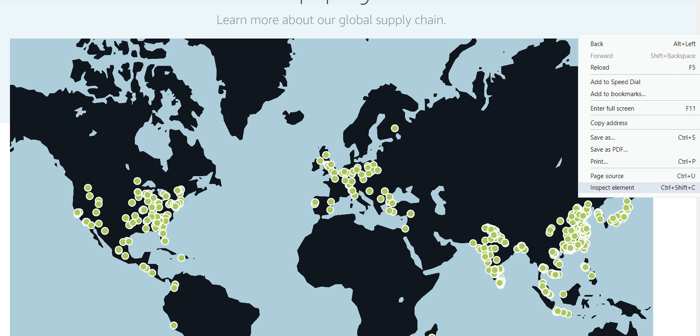
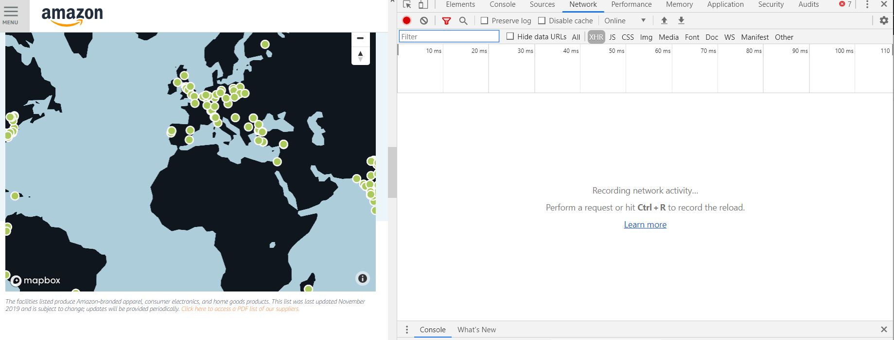
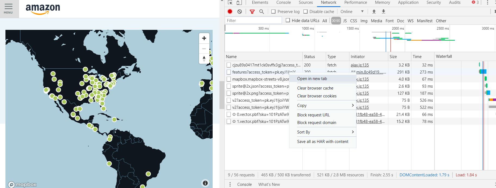
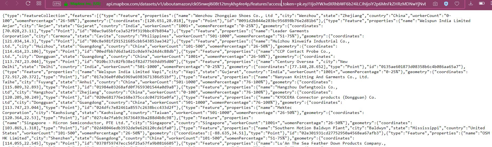

# Amazon data

Inspired by the following twitter post where @EmmanuelFreuden pointed out the existence of a list of suppliers of Amazon I inmediately jumped into the link to try to see how this data looked like.

[https://twitter.com/EmmanuelFreuden/status/1197178396838711296](https://twitter.com/EmmanuelFreuden/status/1197178396838711296)

Supply chains is a topic of interest for me, as it is highly linked with my everyday work.  Data referenced in the link contained a PDF with just names of suppliers, address, city and country. This is  already interesting information, but some geocoding would need to be done, plus it doesn't provide more info, which would be great for a tidy tuesday entry.

Next, I jumped into the webpage of Amazon to see if there is some more information there. I found a map where when choosing a point it displayed more information such as quantity of workers, and percentage of women working in each of the suppliers.

[Social responsibility](https://sustainability.aboutamazon.com/social-responsibility)

That definitely looks like a more interesting information for a tidy-tuesday. So next step was to try to get the data from them map. First step was to try to scrape the page to get the info, but failed.

Then I came accros the following stackoverflow question 

[Scrape latitude and longitude of address obtained from Mapbox](https://stackoverflow.com/questions/49211863/scrape-latitude-and-longitude-of-address-obtained-from-mapbox?noredirect=1&lq=1)

And decided to try the answer of Lasse Sviland, where he suggests to inspect the page and look for the XHR requests.

So, first step is to open the page inspector, go to the page and right mouse button:

Followed by choosing network tab and XHR

Then reload with Ctrl+R to record the requests, we get the lists of requests. Then go and open in a new tab the requests, in this case the second request provides the information we are looking for.

When opening it in a new tab we can see the following JSON file, we just copy the link of it an use R to convert it into a data frame.

Look at the R file to perform the transformation from JSON file to csv file

[JoseEchave/tidy-tuesdays](https://github.com/JoseEchave/tidy-tuesdays/blob/master/amazon_suppliers_data/json_to_dataframe.R)